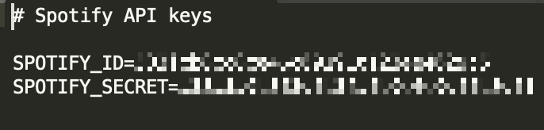
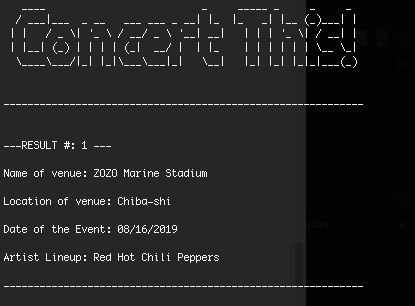
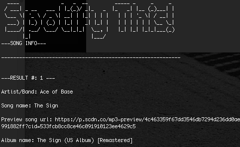
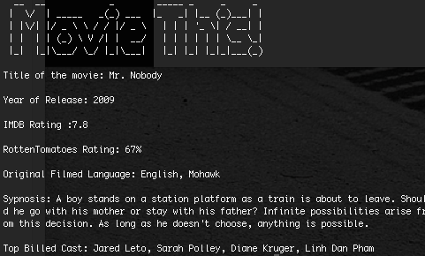

# HW8 LIRI NODE APP

## Installation 
* npm-install for initial download of dependent packages
* requires you to import your own spotify keys by creating .env file in below format.

### Usage
* node liri.js [command] [search term(s)]
* ie: --> node liri.js concert-this red hot chili peppers

### Commands
* concert-this --> searches BandsinTown for upcoming concerts. Accepts search value(s) by Artist/Band name.

* spotify-this --> searches Spotify for Song(s). Accepts search value(s) by song title and/or artist name.

* movie-this --> searches OMDB for movie(s). Accepts search value(s) by movie title.

* random-[input] --> searches via random-[input].txt for random [input] to display. Valid inputs include song, movie or concert. 

### Technologies Used
* Node.JS 
* dotenv
* figlet
* axios
* moment
* Javascript ES6
* Spotify API
* BandsinTown API
* OMDB API

